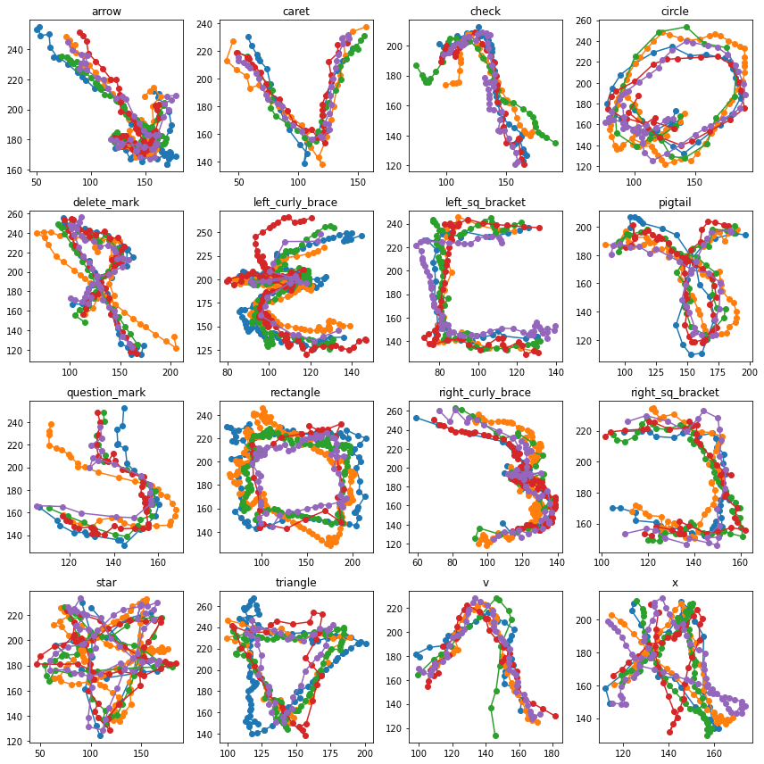

# Effective 2D Stroke-based Gesture Augmentation for RNNs

Implementation of the augmentation methods described in the paper "Effective 2D Stroke-based Gesture Augmentation for RNNs" by Mykola Maslych, Mostafa Aldilati, Dr. Eugene M. Taranta II, and Dr. Joseph J. LaViola Jr. (2023) <https://doi.org/10.1145/3544548.3581358>. Check out more of our research at <https://www.eecs.ucf.edu/isuelab/>.

RNNs show great performance on time-series tasks, but specifically for custom gestures, the data provided by a user is not enough to train an accurate model. We evaluate a number of existing augmentation methods and chain them into series of transformations that maximize accuracy.  

The following is some sample synthetic stroke gestures from the [$1-GDS](http://depts.washington.edu/acelab/proj/dollar/index.html) dataset, produced by All Variability Chain (AVC). This chain of transformations is applies `gaussian noise` -> `frame skipping` -> `spatial resampling` -> `perspective change` -> `rotations` -> `scaling`.



For more examples, check out the `generate_gestures.ipynb` notebook.

## Getting Started

### Pre-requisites

Pre-requisites can be installed by running:

```bash
pip install -r requirements.txt
```

* Python 3.9+
* Pytorch 1.13.1
* Pytorch Lightning 1.9.0
* SciPy 1.10.0
* NumPy 1.23.5
* Matplotlib 3.6.2
* Torchmetrics 0.11.1
* (Optional) CUDA Toolkit (for GPU support)

### Training the model

To train the model, run the following command:

```bash
python main.py
```

You can also specify arguments, run `python main.py --help` to see the list of available arguments.

## Citing

If you use this code for your research, please cite our paper:

```bibtex
@inproceedings{10.1145/3544548.3581358,
    author = {Maslych, Mykola and Taranta, Eugene Matthew and Aldilati, Mostafa and Laviola, Joseph J.},
    title = {Effective 2D Stroke-Based Gesture Augmentation for RNNs},
    year = {2023},
    isbn = {9781450394215},
    publisher = {Association for Computing Machinery},
    address = {New York, NY, USA},
    url = {https://doi.org/10.1145/3544548.3581358},
    doi = {10.1145/3544548.3581358},
    booktitle = {Proceedings of the 2023 CHI Conference on Human Factors in Computing Systems},
    articleno = {282},
    numpages = {13},
    keywords = {neural networks, datasets, gesture recognition and customization, data augmentation},
    location = {Hamburg, Germany},
    series = {CHI '23}
}
```

## Contributions and Bug Reports

Contributions are welcome. Please submit your contributions as a pull request and we will incorporate them. If you find any bugs, please report them as an issue.
